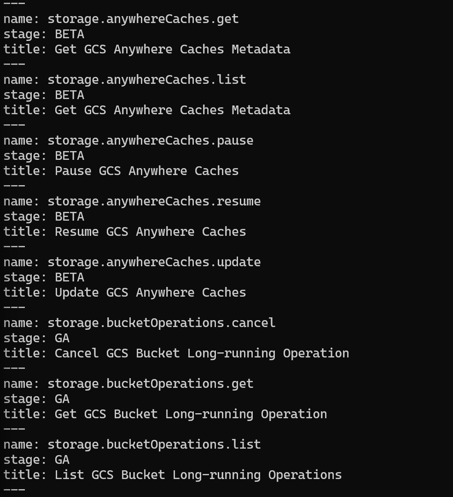
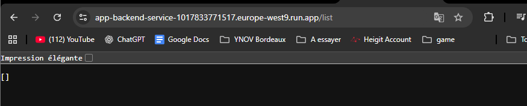
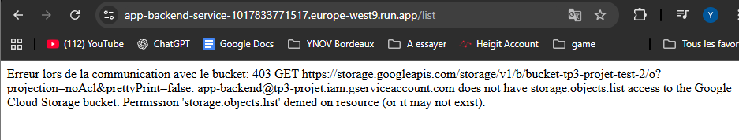
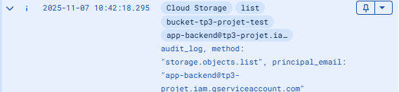
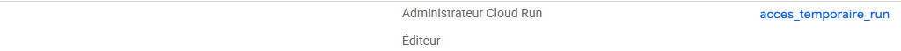

# 🧾 Exercice 1 : Créer les identités de base

## 1. Création du projet

```bash
gcloud projects create tp3-projet
```

**Explication :**
La commande `gcloud projects create` crée un nouveau projet avec l'identifiant unique `tp3-projet`. Cet ID doit être en minuscules et unique au monde.

**Sortie :**

```text
Create in progress for [https://cloudresourcemanager.googleapis.com/v1/projects/tp3-projet].
Waiting for [operations/create_project.global.5762750760424319222] to finish...done.
Enabling service [cloudapis.googleapis.com] on project [tp3-projet]...
Operation "operations/acat.p2-1017833771517-842c591a-0ff7-4d17-89e1-223581cb452d" finished successfully.
```

---

## 2. Définition du projet actif

```bash
gcloud config set project tp3-projet
```

**Explication :**
Cette commande modifie la configuration locale du Cloud SDK afin d'éviter d'avoir à spécifier `--project=tp3-projet` à chaque commande.

**Sortie :**

```text
Updated property [core/project].
```

---

## 3. Ajout des utilisateurs IAM

### a. Utilisateur Lecteur (Viewer)

**Objectif :** Ajouter un utilisateur avec le rôle `roles/viewer`, pour un accès en lecture seule.

```bash
gcloud projects add-iam-policy-binding tp3-projet --member="user:EMAIL-DU-LECTEUR" --role="roles/viewer"
```

**Explication :**
`add-iam-policy-binding` ajoute une liaison entre un membre et un rôle pour une ressource, sans remplacer la politique existante.

**Pour le compte rendu :**

```bash
gcloud projects add-iam-policy-binding tp3-projet --member="user:Yann.Eyheregaray@gmail.com" --role="roles/viewer"
```

---

### b. Utilisateur Collaborateur (Editor)

**Objectif :** Ajouter un second utilisateur avec le rôle `roles/editor`, pour un accès en lecture et écriture.

```bash
gcloud projects add-iam-policy-binding tp3-projet --member="user:EMAIL-DU-COLLABORATEUR" --role="roles/editor"
```

**Pour le compte rendu :**

```bash
gcloud projects add-iam-policy-binding tp3-projet --member="user:yannmc.anime@gmail.com" --role="roles/editor"
```

**Résultat :**

```yaml
Updated IAM policy for project [tp3-projet].
bindings:
- members:
  - user:yannmc.anime@gmail.com
  role: roles/editor
- members:
  - user:eyheregaray.yann@gmail.com
  role: roles/owner
- members:
  - user:Yann.Eyheregaray@gmail.com
  role: roles/viewer
etag: BwZC6rj6ucI=
version: 1
```

---

## 4. Création d'un compte de service

**Objectif :** Créer une identité non-humaine pour une future application backend.

```bash
gcloud iam service-accounts create app-backend --display-name="Application Backend"
```

**Explication :**
Crée un compte de service nommé `app-backend`, avec un nom d'affichage facilitant son identification.

**Sortie :**

```text
Created service account [app-backend].
```

---

## 5. Vérification des comptes de service

```bash
gcloud iam service-accounts list
```

```text
DISPLAY NAME         EMAIL                                           DISABLED
Application Backend  app-backend@tp3-projet.iam.gserviceaccount.com  False
```

**Explication :**
Liste les comptes de service associés au projet actif.

---

# 🧾 Exercice 2 : Explorer IAM et les rôles

## 1. Lister les membres IAM

```bash
gcloud projects get-iam-policy tp3-projet --format="yaml"
```

**Sortie :**

```yaml
bindings:
- members:
  - user:yannmc.anime@gmail.com
  role: roles/editor
- members:
  - user:eyheregaray.yann@gmail.com
  role: roles/owner
- members:
  - user:Yann.Eyheregaray@gmail.com
  role: roles/viewer
etag: BwZC6rj6ucI=
version: 1
```

**Analyse :**

* Le compte `eyheregaray.yann@gmail.com` est bien `roles/owner` → droits administrateur.
* Les rôles `roles/viewer` et `roles/editor` sont correctement attribués aux utilisateurs ajoutés.
* Les champs `etag` et `version` servent à gérer les modifications concurrentielles de la politique IAM.

# 🧾 Exercice 3 : Portée des rôles et permissions atomiques

1. Comprendre les permissions d’un rôle

```bash
gcloud iam roles describe roles/storage.objectViewer
```

```text
description: Grants access to view objects and their metadata, excluding ACLs. Can
  also list the objects in a bucket.
etag: AA==
includedPermissions:
- resourcemanager.projects.get
- resourcemanager.projects.list
- storage.folders.get
- storage.folders.list
- storage.managedFolders.get
- storage.managedFolders.list
- storage.objects.get
- storage.objects.list
name: roles/storage.objectViewer
stage: GA
title: Storage Object Viewer
```

2. Créer une ressource pour vos tests

```bash
gcloud storage buckets create gs://bucket-tp3-projet-test
```

```text
Creating gs://bucket-tp3-projet-test/...
```

3. Lister les permissions disponibles sur une ressource

**Question :** Quelle commande permet d’afficher toutes les permissions testables pour une ressource donnée ?

```bash
gcloud iam list-testable-permissions //storage.googleapis.com/projects/_/buckets/bucket-tp3-projet-test
```



**Identifiez celles qui permettent la lecture des objets.**

* `storage.objects.get` (Titre : Read GCS Object Data and Metadata)
* `storage.objects.list` (Titre : List GCS Objects)

4. Accorder un rôle sur une ressource spécifique

**Question :** Quelle commande permet d’attribuer un rôle IAM à un utilisateur ou groupe uniquement sur une ressource (ici, le bucket) ?

```bash
gcloud storage buckets add-iam-policy-binding [URL-DU-BUCKET] --member="user:[EMAIL]" --role="[NOM-DU-ROLE]"
```

**Utilisez-la pour accorder le rôle Storage Object Viewer à votre collaborateur sur ce bucket.**

```bash
gcloud storage buckets add-iam-policy-binding gs://bucket-tp3-projet-test --member="user:Yann.Eyheregaray@gmail.com" --role="roles/storage.objectViewer"
```

```yaml
bindings:
- members:
  - projectEditor:tp3-projet
  - projectOwner:tp3-projet
  role: roles/storage.legacyBucketOwner
- members:
  - projectViewer:tp3-projet
  role: roles/storage.legacyBucketReader
- members:
  - user:Yann.Eyheregaray@gmail.com
  role: roles/storage.objectViewer
etag: CAI=
kind: storage#policy
resourceId: projects/_/buckets/bucket-tp3-projet-test
version: 1
```

5. Tester l’accès restreint

*Connectez-vous avec le compte collaborateur.*

```bash
gcloud auth login
```

**Essayez de :**

* lister les objets du bucket ;
* télécharger un objet ;

```text
PS C:\Users\yanne\Documents\TP3> gcloud storage ls gs://bucket-tp3-projet-test
PS C:\Users\yanne\Documents\TP3> gcloud storage buckets list
---
creation_time: 2025-11-06T13:01:52+0000
default_storage_class: STANDARD
generation: 1762434111896088489
location: US
location_type: multi-region
metageneration: 2
name: bucket-tp3-projet-test
public_access_prevention: inherited
rpo: DEFAULT
soft_delete_policy:
  effectiveTime: '2025-11-06T13:01:52.224000+00:00'
  retentionDurationSeconds: '604800'
storage_url: gs://bucket-tp3-projet-test/
uniform_bucket_level_access: false
update_time: 2025-11-06T13:16:25+0000
PS C:\Users\yanne\Documents\TP3>
```

* accéder à un autre bucket du même projet.

```bash
gcloud storage ls gs://bucket-tp3-projet-test-2
```

**Quelles opérations fonctionnent ? Lesquelles échouent ? Pourquoi ?**

6. Étendre le rôle au niveau projet

**Question :** Quelle commande permet d’accorder un rôle à un utilisateur au niveau projet cette fois ?

```bash
gcloud projects add-iam-policy-binding
```

**Appliquez-la pour attribuer le rôle Storage Object Viewer sur tout le projet.**

```bash
gcloud projects add-iam-policy-binding tp3-projet --member="user:Yann.Eyheregaray@gmail.com" --role="roles/storage.objectViewer"
```

```yaml
Updated IAM policy for project [tp3-projet].
bindings:
- members:
  - user:yannmc.anime@gmail.com
  role: roles/editor
- members:
  - user:eyheregaray.yann@gmail.com
  role: roles/owner
- members:
  - user:Yann.Eyheregaray@gmail.com
  role: roles/storage.objectViewer
- members:
  - user:Yann.Eyheregaray@gmail.com
  role: roles/viewer
etag: BwZC7RvC9mc=
version: 1
```

### Exercice 3 – Analyse fusionnée des Étapes 5 et 7

**1. Ce qui s'est passé (Vos résultats réels)**

*Analyse de l'Étape 5 (Après ajout du rôle au BUCKET)*

* **Test 1 (Bucket 1)** : `gcloud storage ls gs://bucket-tp3-projet-test` ➔ **SUCCÈS**.
* **Test 2 (Bucket 2)** : `gcloud storage ls gs://bucket-tp3-projet-test-2` ➔ **SUCCÈS**.

*Pourquoi les deux ont réussi ?* *L'utilisateur "Lecteur" avait le rôle roles/viewer sur tout le projet. Ce rôle legacy inclut la permission storage.objects.list pour tous les buckets. Par conséquent, les tests ont réussi à cause de ce rôle, rendant l'ajout du rôle roles/storage.objectViewer sur le Bucket 1 (Étape 4) totalement redondant.*

*Analyse de l'Étape 7 (Après ajout du rôle au PROJET)*

* **Test 1 (Bucket 1)** : `gcloud storage ls gs://bucket-tp3-projet-test` ➔ **SUCCÈS**.
* **Test 2 (Bucket 2)** : `gcloud storage ls gs://bucket-tp3-projet-test-2` ➔ **SUCCÈS**.

*Pourquoi les deux ont (encore) réussi ?* *Le résultat est identique, mais la permission est maintenant accordée pour deux raisons (par union) :*

* *Le rôle roles/viewer (Projet)*
* *Le rôle roles/storage.objectViewer (Projet)*

**2. Ce qui AURAIT DÛ se passer (Intention du TP)**

*L'exercice n'aurait pas dû vous faire utiliser le rôle roles/viewer à l'Exercice 1. Si nous avions utilisé un utilisateur sans aucun rôle de projet, voici ce qui se serait passé :*

*Analyse (corrigée) de l'Étape 5 (Rôle sur BUCKET 1 uniquement)*

* **Test 1 (Bucket 1)** : `gcloud storage ls gs://bucket-tp3-projet-test` ➔ **SUCCÈS**.

*Pourquoi ? L'utilisateur a le rôle storage.objectViewer sur ce bucket.*

* **Test 2 (Bucket 2)** : `gcloud storage ls gs://bucket-tp3-projet-test-2` ➔ **ÉCHEC (Permission Denied)**.

*Pourquoi ? L'utilisateur n'a aucune permission sur ce bucket.*

*Analyse (corrigée) de l'Étape 7 (Rôle étendu au PROJET)*

* **Test 1 (Bucket 1)** : `gcloud storage ls gs://bucket-tp3-projet-test` ➔ **SUCCÈS**.
* **Test 2 (Bucket 2)** : `gcloud storage ls gs://bucket-tp3-projet-test-2` ➔ **SUCCÈS**.

*Pourquoi ? L'utilisateur a maintenant le rôle storage.objectViewer au niveau projet, il hérite donc de la permission sur le Bucket 2.*


La comparaison entre la portée "Ressource" (Étape 4) et "Projet" (Étape 6) a été faussée car l'utilisateur "Lecteur" possédait le rôle roles/viewer au niveau du projet.

Ce rôle roles/viewer est si large qu'il inclut déjà la permission de lister le contenu de tous les buckets (storage.objects.list).

Cela démontre que les rôles de base (Owner, Editor, Viewer) vont à l'encontre du principe de moindre privilège et ne devraient pas être utilisés en production. Ils accordent des milliers de permissions et rendent impossible la gestion fine des accès, comme nous avons pu le constater lorsque nos tests d'accès restreint (Étape 5) ont réussi alors qu'ils auraient dû échouer.*

**8. Nettoyer la configuration**

**Question :** Quelle commande permet de retirer un rôle IAM accordé sur un projet ?

*Réponse :* `remove-iam-policy-binding`


```bash
gcloud projects remove-iam-policy-binding tp3-projet --member="user:Yann.Eyheregaray@gmail.com" --role="roles/storage.objectViewer"
```

```text
PS C:\Users\yanne\Documents\TP3> gcloud projects remove-iam-policy-binding tp3-projet --member="user:Yann.Eyheregaray@gmail.com" --role="roles/storage.objectViewer"
Updated IAM policy for project [tp3-projet].
bindings:
- members:
  - user:yannmc.anime@gmail.com
  role: roles/editor
- members:
  - user:eyheregaray.yann@gmail.com
  role: roles/owner
- members:
  - user:Yann.Eyheregaray@gmail.com
  role: roles/viewer
etag: BwZC7VyBTfQ=
version: 1
PS C:\Users\yanne\Documents\TP3> gcloud storage buckets remove-iam-policy-binding gs://bucket-tp3-projet-test --member="user:Yann.Eyheregaray@gmail.com" --role="roles/storage.objectViewer"
bindings:
- members:
  - projectEditor:tp3-projet
  - projectOwner:tp3-projet
  role: roles/storage.legacyBucketOwner
- members:
  - projectViewer:tp3-projet
  role: roles/storage.legacyBucketReader
- members:
  - serviceAccount:app-backend@tp3-projet.iam.gserviceaccount.com
  role: roles/storage.objectViewer
etag: CAM=
kind: storage#policy
resourceId: projects/_/buckets/bucket-tp3-projet-test
version: 1
```


---

# Exercice 4 — Créer un rôle personnalisé pour Cloud Run

## 1. Identifier les permissions nécessaires


**Quelles permissions sont nécessaires pour :**

* déployer un service Cloud Run ?

*`run.services.create` (pour la création initiale)*

*`run.services.update` (pour les déploiements suivants, qui sont des mises à jour)*

* lister les services existants ?

*`run.services.list` (pour voir la liste de tous les services)*

*`run.services.get` (pour voir les détails d'un service spécifique)*

* supprimer un service ?

*`run.services.delete`*

## 2. Créer le fichier de définition


**Quelles sont les sections obligatoires de ce fichier ?**

*Un fichier de définition de rôle personnalisé YAML a 4 sections obligatoires :*

* *title : Un nom convivial pour votre rôle (ex: "Déployeur Cloud Run").*
* *description : Une courte explication de ce que fait le rôle.*
* *stage : L'état de lancement du rôle. Pour un usage normal, on utilise GA (General Availability).*
* *includedPermissions : La liste des permissions atomiques que le rôle accorde.*

**Ajoutez les permissions nécessaires pour permettre la création, la lecture et la suppression de services Cloud Run**

**Contenu du fichier `role-cloudrun-deployer.yaml` :**

```yaml
title: "Déployeur Cloud Run Personnalisé"
description: "Permet de créer, lister, mettre à jour et supprimer des services Cloud Run."
stage: "GA"
includedPermissions:
  # Permissions pour créer et mettre à jour
  - run.services.create
  - run.services.update
  
  # Permissions pour lister et lire
  - run.services.list
  - run.services.get
  
  # Permission pour supprimer
  - run.services.delete
  
  # Permission essentielle pour le déploiement
  - iam.serviceAccounts.actAs
```

## 3. Créer le rôle dans votre projet

**Question :** Quelle commande permet de créer un rôle IAM à partir d’un fichier YAML ?

*Réponse :* `gcloud iam roles create`


```text
S C:\Users\yanne\Documents\TP3> gcloud iam roles create deployeurCloudRun --project=tp3-projet --file=role-cloudrun-deployer.yaml
WARNING: API is not enabled for permissions: [run.services.create, run.services.update, run.services.list, run.services.get, run.services.delete]. Please enable the corresponding APIs to use those permissions.

Created role [deployeurCloudRun].
description: Permet de cr?er, lister, mettre ? jour et supprimer des services Cloud
  Run.
etag: BwZC7YTvNy4=
includedPermissions:
- iam.serviceAccounts.actAs
- run.services.create
- run.services.delete
- run.services.get
- run.services.list
- run.services.update
name: projects/tp3-projet/roles/deployeurCloudRun
stage: GA
title: D?ployeur Cloud Run Personnalis?
```

**Où pouvez-vous vérifier sa présence après création ?**

```bash
gcloud iam roles describe deployeurCloudRun --project=tp3-projet
```

```text
description: Permet de cr?er, lister, mettre ? jour et supprimer des services Cloud
  Run.
etag: BwZC7YTvNy4=
includedPermissions:
- iam.serviceAccounts.actAs
- run.services.create
- run.services.delete
- run.services.get
- run.services.list
- run.services.update
name: projects/tp3-projet/roles/deployeurCloudRun
stage: GA
title: D?ployeur Cloud Run Personnalis?
```

## 4. Attribuer le rôle à un utilisateur

**Question :** Quelle commande permet d’accorder un rôle IAM à une identité sur un projet ?

*Réponse :* `gcloud projects add-iam-policy-binding`


```bash
gcloud projects add-iam-policy-binding tp3-projet --member="user:yannmc.anime@gmail.com" --role="projects/tp3-projet/roles/deployeurCloudRun"
```

```yaml
Updated IAM policy for project [tp3-projet].
bindings:
- members:
  - user:yannmc.anime@gmail.com
  role: projects/tp3-projet/roles/deployeurCloudRun
- members:
  - user:yannmc.anime@gmail.com
  role: roles/editor
- members:
  - user:eyheregaray.yann@gmail.com
  role: roles/owner
- members:
  - user:Yann.Eyheregaray@gmail.com
  role: roles/viewer
etag: BwZC7aIgZKE=
version: 1
```

**Pourquoi est-il important d’attribuer ce rôle à un autre compte que le vôtre pour le tester ?**

Le compte principal ([eyheregaray.yann@gmail.com](mailto:eyheregaray.yann@gmail.com)) a créé le projet, il a donc le rôle roles/owner. Ce rôle a toutes les permissions sur le projet.*

*Le test serait faussé : Si vous testiez le nouveau rôle personnalisé avec votre compte "Owner", toutes les actions (déployer, lister, supprimer) réussiraient de toute façon. Vous ne pourriez pas savoir si elles ont réussi grâce à votre nouveau rôle personnalisé ou simplement parce que vous êtes Owner.*

*La validation est impossible : Le but du test est de vérifier si le rôle personnalisé (deployeurCloudRun) accorde exactement les permissions nécessaires  et rien de plus. En l'attribuant à un autre compte (le "collaborateur"), vous créez un environnement de test propre. Si le collaborateur peut déployer, c'est uniquement grâce au nouveau rôle que vous lui avez donné.*

## 5. Tester le rôle

*Connectez-vous sur le compte collaborateur.*

```bash
gcloud auth login
```

*Essayez d’effectuer les opérations suivantes :*

* déployer un service Cloud Run depuis une image conteneur,
* lister les services existants,
* supprimer un service.

```text
PS C:\Users\yanne\Documents\TP3> gcloud run services list --region=europe-west9
Listed 0 items.
PS C:\Users\yanne\Documents\TP3> gcloud run deploy service-test-role --image=us-docker.pkg.dev/cloudrun/container/hello --region=europe-west9 --allow-unauthenticated
Deploying container to Cloud Run service [service-test-role] in project [tp3-projet] region [europe-west9]
X  Deploying new service... Done.
  OK Creating Revision...
  OK Routing traffic...
     Setting IAM Policy...
Completed with warnings:
  Setting IAM policy failed, try "gcloud beta run services add-iam-policy-binding --region=europe-west9 --member=allUsers --role=roles/run.invoker service-test-role"
Service [service-test-role] revision [service-test-role-00001-cdx] has been deployed and is serving 100 percent of traffic.
Service URL: https://service-test-role-1017833771517.europe-west9.run.app
PS C:\Users\yanne\Documents\TP3> gcloud run services delete service-test-role --region=europe-west9
Service [service-test-role] will be deleted.

Do you want to continue (Y/n)?  y

Deleting [service-test-role]...done.
Deleted service [service-test-role].
PS C:\Users\yanne\Documents\TP3>
```

**Quelles actions échouent ?**

*Initialement, toutes les actions ont échoué avec une erreur FAILED_PRECONDITION: UREQ_TOS_NOT_ACCEPTED.*

**Pourquoi ?**

*"L'erreur n'était pas due au rôle personnalisé, mais au fait que l'API Cloud Run n'avait jamais été activée sur le projet. L'acceptation des Conditions d'Utilisation de l'API est une action qui requiert les permissions d'un Owner, ce que le compte "Collaborateur" n'avait pas."*

**Que pouvez-vous en déduire (après avoir activé l'API) ?**

*"Après avoir activé l'API avec le compte Owner, les trois tests (list, deploy, delete) effectués par le "Collaborateur" ont tous réussi.

On peut donc en déduire que les permissions incluses dans le rôle deployeurCloudRun (run.services.create, list, delete, get, update et iam.serviceAccounts.actAs) étaient correctes et suffisantes pour gérer le cycle de vie d'un service Cloud Run."*

## Exercice 4 – Étape 6 : Analyser et corriger

**1. Analyse de l'échec**

*Permissions mentionnées : Dans notre cas, les actions (list, deploy) n'ont pas échoué à cause d'une permission IAM manquante. L'erreur était FAILED_PRECONDITION: UREQ_TOS_NOT_ACCEPTED.*

*Pertinence : Cette erreur n'est pas pertinente pour notre fichier YAML. Elle indique un problème de configuration du projet (l'API n'est pas activée et les conditions d'utilisation ne sont pas acceptées), ce qui ne peut être corrigé qu'avec un rôle Owner.*

*Conclusion : Notre fichier YAML est (très probablement) correct. Nous n'avons pas besoin d'y ajouter de permissions.*

**2. Commande de mise à jour (Pour votre compte-rendu)**

*Si notre rôle avait été incomplet (par exemple, s'il manquait iam.serviceAccounts.actAs), la commande pour le mettre à jour est :*

```bash
gcloud iam roles update
```

*Voici comment gérer cette étape, en tenant compte de ce qui s'est réellement passé (l'erreur TOS).*

### 🧾 Exercice 4 – Étape 6 : Analyser et corriger

**1. Analyse de l'échec**

*Permissions mentionnées : Dans notre cas, les actions (list, deploy) n'ont pas échoué à cause d'une permission IAM manquante. L'erreur était FAILED_PRECONDITION: UREQ_TOS_NOT_ACCEPTED.*

*Pertinence : Cette erreur n'est pas pertinente pour notre fichier YAML. Elle indique un problème de configuration du projet (l'API n'est pas activée et les conditions d'utilisation ne sont pas acceptées), ce qui ne peut être corrigé qu'avec un rôle Owner.*

*Conclusion : Notre fichier YAML est (très probablement) correct. Nous n'avons pas besoin d'y ajouter de permissions.*

**2. Commande de mise à jour (Pour votre compte-rendu)**

*Si notre rôle avait été incomplet (par exemple, s'il manquait iam.serviceAccounts.actAs), la commande pour le mettre à jour est :*

```bash
gcloud iam roles update
```

**Commande complète :**

*Bash*

```bash
gcloud iam roles update deployeurCloudRun --project=tp3-projet --file=role-cloudrun-deployer.yaml
```

*Explication : La commande est presque identique à la création, mais utilise update au lieu de create. Elle prend l'ID du rôle à mettre à jour (deployeurCloudRun) et le fichier YAML contenant les nouvelles permissions.*

**3. Appliquer la modification et refaire les tests**

*Dans notre cas, la "modification" n'était pas dans le fichier YAML, mais dans l'activation de l'API par le compte Owner.*

*L'action correcte est donc de :*

* *Se connecter en tant qu'Owner.*
* *Activer l'API Cloud Run (par exemple, en lançant `gcloud run services list --region=europe-west9` et en disant "oui").*
* *Se reconnecter en tant que Collaborateur .*
* *Refaire les tests de l'étape 5.*

**7. Nettoyer la configuration**

**Question :** Quelle commande permet de supprimer un rôle personnalisé du projet ?

*Réponse :* `gcloud iam roles delete`

**Dans quel cas est-il préférable de le retirer plutôt que de le conserver ?**

*Il est préférable de le retirer pour respecter le principe du moindre privilège et maintenir une bonne "hygiène" de sécurité :*

* *S'il est temporaire : Si le rôle a été créé pour une tâche spécifique et temporaire (par ex: une migration, un test), il doit être supprimé dès que la tâche est terminée.*
* *S'il est obsolète : Si l'application ou le besoin pour lequel le rôle a été créé n'existe plus, le rôle doit être supprimé.*
* *Pour réduire la surface d'attaque : Chaque rôle que vous conservez est un rôle qui pourrait être mal configuré ou attribué par erreur à l'avenir. Moins vous avez de rôles personnalisés inutiles, plus votre projet est facile à sécuriser.*

---

# Exercice 5 — Gérer les comptes de service et les droits applicatifs

## 1. Attribuer le rôle approprié

* *`storage.objects.list` : Pour lister le contenu (les objets) du bucket.*
* *`storage.objects.get` : Pour lire ou télécharger les données d'un objet.*

**Quel rôle prédéfini contient ces permissions ?**

*`roles/storage.objectViewer` (Lecteur des objets de stockage).*

## 3. Commande d'attribution au compte de service

```bash
gcloud storage buckets add-iam-policy-binding gs://bucket-tp3-projet-test --member="serviceAccount:app-backend@tp3-projet.iam.gserviceaccount.com" --role="roles/storage.objectViewer"
```

```yaml
bindings:
- members:
  - projectEditor:tp3-projet
  - projectOwner:tp3-projet
  role: roles/storage.legacyBucketOwner
- members:
  - projectViewer:tp3-projet
  role: roles/storage.legacyBucketReader
- members:
  - serviceAccount:app-backend@tp3-projet.iam.gserviceaccount.com
  role: roles/storage.objectViewer
etag: CAQ=
kind: storage#policy
resourceId: projects/_/buckets/bucket-tp3-projet-test
version: 1
```

**Pourquoi éviter l'attribution au niveau projet ?**

*C'est l'application directe du principe du moindre privilège*

*Si nous accordions ce rôle au niveau projet, le compte de service app-backend pourrait lire le contenu de tous les buckets du projet (actuels et futurs)*

*Si nous accordions ce rôle au niveau projet, le compte de service app-backend pourrait lire le contenu de tous les buckets du projet (actuels et futurs)*

**Quelles bibliothèques client devez-vous installer ?**

*La bibliothèque principale est google-cloud-storage. Nous avons aussi besoin de Flask pour le serveur web et gunicorn pour le déploiement.*

**Quelle variable d'environnement permettra de définir le nom du bucket ?**

*Dans notre code, nous avons utilisé une variable nommée BUCKET_NAME. L'application lira os.environ.get('BUCKET_NAME') pour savoir quel bucket interroger.*

**Comment votre application s'authentifie-t-elle automatiquement ?**

*L'application utilise une stratégie appelée "Application Default Credentials" (ADC).

Lorsque le code s'exécute sur Cloud Run, la bibliothèque client (storage.Client()) ne cherche pas de clé ou de mot de passe.

Elle "voit" qu'elle s'exécute dans un environnement Google Cloud et demande automatiquement au service Cloud Run : "Quelle est mon identité ?".

Cloud Run lui répond en lui donnant l'identité du compte de service que nous lui attacherons lors du déploiement (le compte app-backend).

L'application utilise ensuite cette identité pour appeler l'API Cloud Storage, qui vérifiera si ce compte de service a bien le rôle storage.objectViewer sur le bucket.*

## 3. Conteneuriser l’application

**Rédigez un Dockerfile minimal pour exécuter votre application**

*docker file :*

```dockerfile
# Étape 1 : Utiliser une image de base Python officielle et légère
FROM python:3.10-slim

# Étape 2 : Définir le répertoire de travail dans le conteneur
WORKDIR /app

# Étape 3 : Copier le fichier des dépendances
COPY requirements.txt .

# Étape 4 : Installer les dépendances
# --no-cache-dir réduit la taille de l'image
RUN pip install --no-cache-dir -r requirements.txt

# Étape 5 : Copier le reste du code de l'application (main.py)
COPY . .

# Étape 6 : Définir le port par défaut que Cloud Run écoutera
# $PORT est automatiquement injecté par Cloud Run, 8080 est le défaut
ENV PORT 8080

# Étape 7 : Commande pour exécuter l'application en production avec Gunicorn
# Gunicorn écoute sur toutes les interfaces (0.0.0.0) sur le port 8080
# main:app fait référence à l'objet 'app' dans le fichier 'main.py'
CMD ["gunicorn", "--bind", "0.0.0.0:8080", "main:app"]
```

**Voici les réponses aux questions de cette étape.**


### 🧾 Exercice 5 – Étape 3 : Conteneuriser l'application

**Quelle instruction détermine le port utilisé par Cloud Run ?**

*C'est la variable d'environnement PORT.*

*Cloud Run injecte automatiquement une variable d'environnement nommée PORT (qui vaut 8080 par défaut) dans votre conteneur. Votre application doit écouter sur ce port spécifique.*

*Dans le Dockerfile que nous avons rédigé, la dernière ligne (CMD) s'assure de cela. Une version encore plus robuste de cette ligne serait :*

**Dockerfile**

```dockerfile
# Lit la variable $PORT (fournie par Cloud Run) et l'utilise
CMD ["gunicorn", "--bind", "0.0.0.0:$PORT", "main:app"]
```

**Comment pouvez-vous tester localement votre conteneur ?**

*Vous pouvez le tester localement en utilisant Docker sur votre machine. Cela se fait en deux étapes :*

*Construire l'image (en lui donnant un nom, par exemple app-test) :*

```bash
docker build -t app-test .
```

*Exécuter l'image (en mappant le port et en passant les variables d'environnement) :*

```bash
docker run -p 8080:8080 -e PORT=8080 -e BUCKET_NAME="bucket-tp3-projet-test" app-test
```

*Une fois le conteneur démarré, vous pouvez ouvrir votre navigateur et visiter [http://localhost:8080/list](http://localhost:8080/list)*

**Quelle commande permet de construire l’image et de la publier ?**

*`gcloud builds submit`*

*ici `gcloud builds submit --tag europe-west9-docker.pkg.dev/tp3-projet/cloudrun-repo/app-backend .`*

## 4. Déployer sur Cloud Run

*Déployez le service sur Cloud Run en précisant :*

* *le nom du service ;*
* *la région de déploiement ;*
* *le compte de service run-backend via l’option appropriée ;*
* *l’image conteneur créée précédemment ;*

**Étape 4 : Déploiement sur Cloud Run**

*L'objectif de cette étape est de déployer l'application conteneurisée sur Cloud Run, en s'assurant qu'elle utilise l'identité (compte de service) app-backend.*

*Le déploiement s'est déroulé en trois commandes principales :*

**1. Création du dépôt Artifact Registry**

*Avant de publier l'image, un dépôt Artifact Registry (le registre de conteneurs de Google) a été créé pour la stocker.*

**Commande :**

*Bash*

```bash
gcloud artifacts repositories create cloudrun-repo --repository-format=docker --location=europe-west9
```

*Résultat (Capture d'écran/Texte) : (Incluez ici la sortie Created repository [cloudrun-repo].)*

**2. Construction et Publication de l'image**

*Ensuite, la commande gcloud builds submit a été utilisée. Elle lit le Dockerfile dans le dossier local, construit l'image conteneur via Cloud Build, et la publie dans le dépôt créé à l'étape précédente.*

**Commande :**

*Bash*

```bash
gcloud builds submit --tag europe-west9-docker.pkg.dev/tp3-projet/cloudrun-repo/app-backend .
```

*Résultat (Capture d'écran/Texte) : (Incluez ici la sortie STATUS: SUCCESS que vous venez d'obtenir)*

**3. Déploiement du service sur Cloud Run**

*Une fois l'image publiée, la commande gcloud run deploy a pu être lancée pour créer le service.*

**Commande :**

*PowerShell*

```powershell
gcloud run deploy app-backend-service --image=europe-west9-docker.pkg.dev/tp3-projet/cloudrun-repo/app-backend --service-account=app-backend@tp3-projet.iam.gserviceaccount.com --region=europe-west9 --set-env-vars=BUCKET_NAME=gs://bucket-tp3-projet-test --allow-unauthenticated
```

*(Cette commande doit être exécutée maintenant pour finaliser l'étape)*

**Analyse de la commande : Cette commande répond à toutes les exigences du TP :**

* *Nom du service : app-backend-service*
* *Image conteneur : --image=.../app-backend*
* *Région : --region=europe-west9*
* *Compte de service : L'option --service-account a été utilisée pour attacher notre compte app-backend@....*

**Configuration supplémentaire :**

* *`--set-env-vars=...` : Essentiel pour injecter le nom du bucket (BUCKET_NAME) dans l'application.*
* *`--allow-unauthenticated` : Permet de tester publiquement le service.*

**Quelle option CLI permet de spécifier le compte de service ?**

*L'option CLI qui permet de spécifier le compte de service associé au déploiement est `--service-account`.*

**Exemple (tiré de notre commande) :**

*Bash*

```bash
--service-account=app-backend@tp3-projet.iam.gserviceaccount.com
```

**Où vérifier dans la console ?**

*Vous pouvez vérifier que Cloud Run utilise le bon compte de service en suivant ces étapes :*

1. *Dans la console Google Cloud, allez à Cloud Run.*
2. *Cliquez sur le nom de votre service (par exemple, app-backend-service).*
3. *Une fois sur la page du service, cliquez sur l'onglet "Sécurité" (Security).*
4. *Le champ "Compte de service" (Service account) affichera l'e-mail du compte que le service utilise pour s'exécuter. Vous devriez y voir [app-backend@tp3-projet.iam.gserviceaccount.com](mailto:app-backend@tp3-projet.iam.gserviceaccount.com).*

** Tester le service**

*Accédez à lʼURL du service Cloud Run.*

*Exécutez la route /list .*

*Le contenu du bucket sʼaffiche-t-il*

*Oui. Le service a renvoyé une liste JSON vide ([]), ce qui correspond au contenu de notre bucket.*



**Que se passe-t-il si le service tente d'accéder à un autre bucket ?**

*Il échouera. Si nous modifions la variable d'environnement BUCKET_NAME pour pointer vers bucket-tp3-projet-test-2 (que nous avons créé à l'exercice 3), l'application plantera avec une erreur 403 Forbidden (Permission Denied).*



*Pourquoi ? Parce que nous n'avons accordé le rôle roles/storage.objectViewer au compte de service app-backend uniquement sur le premier bucket. Il n'a aucune permission sur le deuxième.*

**Comment ce comportement illustre-t-il le moindre privilège ?**

*Cela l'illustre parfaitement. Nous avons donné à notre application la permission minimale (lecture seule) sur la ressource minimale (un seul bucket) dont elle a besoin. Si l'application est compromise, les dégâts sont contenus à ce seul bucket, et non à l'ensemble du projet.*

** Observer les logs**

*Rendez-vous dans Cloud Logging  Logs Explorer.*

*Recherchez les entrées correspondant à votre service Cloud Run et aux requêtes Cloud Storage.*

**Quelle identité (principalEmail) apparaît dans les logs ?**

**Comment pouvez-vous confirmer que cʼest bien le compte de service run-backend qui a effectué la lecture du bucket**

1. **Quelle identité (principalEmail) apparaît dans les logs ?**

*Comme le montre votre capture d'écran, l'identité est : [app-backend@tp3-projet.iam.gserviceaccount.com](mailto:app-backend@tp3-projet.iam.gserviceaccount.com)*

2. **Comment pouvez-vous confirmer que c'est bien ce compte ?**

*Votre log le confirme de trois façons :*

* *Le principal_email : Il identifie l'acteur comme étant votre compte de service app-backend.*
* *La method : L'action effectuée est storage.objects.list, ce qui correspond exactement à ce que fait votre code (bucket.list_blobs()).*
* *La ressource : Le log confirme que l'action a eu lieu sur la ressource bucket-tp3-projet-test.*



**Étape 7 : Nettoyer la configuration**


```bash
gcloud run services delete app-backend-service --region=europe-west9
```

**Pourquoi est-il risqué de laisser un compte de service inactif ou surdimensionné en permissions dans un projet Cloud ?**

*Compte inactif : C'est une "porte" oubliée. Si un attaquant parvient à usurper l'identité de ce compte que personne ne surveille, il peut agir sans être détecté.*

*Compte surdimensionné (trop de permissions) : C'est le non-respect du moindre privilège. Si votre application est compromise, un attaquant peut utiliser ses permissions excessives (par exemple, un rôle Editor de projet) pour supprimer toutes vos VM, bases de données, et voler toutes vos données, même si l'application n'avait besoin que de lire un seul bucket.*

---


# Exercice 6 : Délégation (Impersonation)

## 1. Créer un nouveau compte de service

```bash
gcloud iam service-accounts create deploy-automation --display-name="Compte de service pour automation"
```

## 2. Accorder la permission d'impersonation

*Pour permettre à un utilisateur d'impersoner un compte de service , le rôle requis est `roles/iam.serviceAccountTokenCreator` (Créateur de jetons de compte de service)*

**Sur quelle ressource cette permission doit-elle être appliquée ?**

*Cette permission doit être appliquée au niveau le plus strict : sur le compte de service lui-même*

**Pourquoi ne faut-il jamais donner ce rôle à tous les utilisateurs du projet ?**

*Ce serait une faille de sécurité majeure. Cela permettrait à n'importe qui d'usurper l'identité de ce compte de service. Si ce compte a des droits élevés, cela permettrait à n'importe quel utilisateur d'escalader ses propres privilèges.*

##  Tester lʼimpersonation

**1. Depuis Cloud Shell, exécutez une commande gcloud en endossant lʼidentité du compte deploy-automation**

```bash
gcloud iam service-accounts add-iam-policy-binding deploy-automation@tp3-projet.iam.gserviceaccount.com --member="user:eyheregaray.yann@gmail.com" --role="roles/iam.serviceAccountTokenCreator"
```

```yaml
Updated IAM policy for serviceAccount [deploy-automation@tp3-projet.iam.gserviceaccount.com].
bindings:
- members:
  - user:eyheregaray.yann@gmail.com
  role: roles/iam.serviceAccountTokenCreator
etag: BwZC_ilqTpg=
version: 1
```

**2.  Quelle option CLI permet de spécifier le compte de service à utiliser temporairement**

*L'option CLI clé pour l'impersonation est `--impersonate-service-account`.*

*Cette option dit à gcloud : "N'utilise pas mon compte [eyheregaray.yann@gmail.com](mailto:eyheregaray.yann@gmail.com) pour cette action. Utilise plutôt l'identité de ce compte de service."*


```bash
gcloud storage buckets list --impersonate-service-account="deploy-automation@tp3-projet.iam.gserviceaccount.com"
```

```text
WARNING: This command is using service account impersonation. All API calls will be executed as [deploy-automation@tp3-projet.iam.gserviceaccount.com].
ERROR: (gcloud.storage.buckets.list) HTTPError 403: deploy-automation@tp3-projet.iam.gserviceaccount.com does not have storage.buckets.list access to the Google Cloud project. Permission 'storage.buckets.list' denied on resource (or it may not exist). This command is authenticated as eyheregaray.yann@gmail.com which is the active account specified by the [core/account] property. Impersonation is used to impersonate deploy-automation@tp3-projet.iam.gserviceaccount.com.
```

**Quelles erreurs pouvez-vous rencontrer ?**


*- PERMISSION_DENIED (Erreur 403) :Elle signifie que l'impersonation a réussi, mais que le compte de service impersoné (deploy-automation) n'a pas la permission requise (par ex: storage.buckets.list) pour exécuter l'action.*

## Étape 4 : Utiliser l'impersonation avec Cloud Run


**1. Dans quel cas pratique utiliser l'impersonation ?**

* Le scénario le plus courant est un système de CI/CD (comme GitHub Actions ou GitLab CI) qui doit déployer une application sur Cloud Run.*


### 🧾 Exercice 6 – Étape 4 : Utiliser l'impersonation avec Cloud Run


**1. Dans quel cas pratique utiliser l'impersonation ?**

*Cas pratique : Le scénario le plus courant est un système de CI/CD (comme GitHub Actions, Jenkins, ou GitLab CI) qui doit déployer une application sur Cloud Run.*


* *Votre CI/CD a sa propre identité Google Cloud (par exemple, un compte de service dédié ou une identité "Workload Identity"). Cette identité a très peu de droits.*
* *Vous avez un compte de service puissant, deploy-automation, qui a les rôles nécessaires pour déployer sur Cloud Run.*
* *Plutôt que de donner une clé privée (un fichier JSON) de deploy-automation à votre CI/CD (ce qui est risqué), vous donnez à l'identité du CI/CD la permission roles/iam.serviceAccountTokenCreator sur deploy-automation.*
* *Lors du déploiement, votre CI/CD s'authentifie avec sa propre identité, puis impersonate deploy-automation pour obtenir un jeton temporaire. C'est ce jeton qui est utilisé pour le déploiement.*
* *Votre CI/CD n'a jamais stocké de clé secrète puissante.*

**2. Quelles bonnes pratiques de sécurité s'appliquent ?**

* *Principe du moindre privilège : Le compte de service impersoné (deploy-automation) ne doit avoir que les rôles strictement nécessaires pour sa tâche (par exemple, roles/run.admin), et non Owner ou Editor.*
* *Portée limitée : N'accordez pas le rôle Service Account Token Creator à un large groupe. Donnez-le uniquement à l'identité spécifique qui doit effectuer l'impersonation (par exemple, le compte de service de votre CI/CD).*
* *Appliquer sur la ressource : Le rôle Token Creator doit être appliqué directement sur le compte de service qui sera impersoné, et non sur l'ensemble du projet.*
* *Audit : Utilisez les Cloud Audit Logs pour surveiller qui impersonate quoi et quand.*

**3. Observer dans les logs**

**Quels champs indiquent le compte de service impersoné ?**

*Le champ `protoPayload.authenticationInfo.principalEmail`.*

*Sa valeur aurait été : `deploy-automation@tp3-projet.iam.gserviceaccount.com`.*

**Quels champs indiquent le compte utilisateur délégant ?**

*Le champ `protoPayload.authenticationInfo.firstPartyPrincipal`.*

*Sa valeur aurait été : `eyheregaray.yann@gmail.com`.*

**Comment cela assure-t-il la traçabilité ?**

*Le log enregistre les deux identités. Il prouve que vous (firstPartyPrincipal) avez donné l'ordre au compte de service (principalEmail) d'exécuter une action. Il est donc impossible de se cacher derrière le compte de service.*

**4. Nettoyer la configuration**

```bash
gcloud iam service-accounts remove-iam-policy-binding deploy-automation@tp3-projet.iam.gserviceaccount.com --member="user:eyheregaray.yann@gmail.com" --role="roles/iam.serviceAccountTokenCreator"
```

**Pourquoi est-il important de révoquer ce type d'accès après usage ?**

*C'est une bonne pratique du moindre privilège. L'impersonation est un privilège élevé. En le révoquant, vous vous assurez qu'il n'est utilisé qu'en cas de besoin et vous réduisez la "fenêtre d'opportunité" pour un attaquant qui aurait pu compromettre votre compte utilisateur.*

**Quels risques apparaissent si un utilisateur le garde ?**

*Le risque principal est l'escalade de privilèges non tracée. Si votre compte utilisateur est*

# 🧾 Exercice 7 — Accès temporaire via IAM

## Conditions

**Quel rôle IAM accorde des droits complets sur les services Cloud Run ?**

*C'est le rôle prédéfini roles/run.admin (Administrateur Cloud Run).*

**Quel rôle pourrait être utilisé pour une élévation temporaire de privilège ?**

*N'importe quel rôle à privilèges élevés. les  de roles/compute.admin (Compute Admin) ou roles/storage.admin (Storage Admin). Le rôle roles/editor (Éditeur) serait aussi un candidat.*

**Choisissez un rôle adapté à votre test.**

*Le rôle roles/run.admin*

---

## 1. Définir la condition temporelle

### 1. Définir la date d'expiration

Nous devons fixer une date d'expiration proche pour pouvoir tester l'échec.

L'heure actuelle est 11:22 (heure de Paris, CET).

Fixons une expiration dans 15 minutes, soit à 11:37 CET.

Google utilise l'heure UTC. CET (Paris) est à UTC+1. L'expiration sera donc à 10:37 UTC.

### 2. Quelle syntaxe CEL permet d'exprimer cette limite ?

La syntaxe utilise la fonction `timestamp()` et l'opérateur `<` (inférieur à).

L'expression complète pour notre condition est :

```text
request.time < timestamp("2025-11-07T10:37:00Z")
```

---

##  Créer le rôle conditionnel

**Quelle commande permet dʼajouter une attribution de rôle avec une condition ?**

```bash
gcloud projects add-iam-policy-binding tp3-projet `
    --member="user:yannmc.anime@gmail.com" `
    --role="roles/run.admin" `
    --condition="expression=request.time < timestamp('2025-11-07T10:40:00Z'),title=acces_temporaire_run,description=Acces admin temporaire"
```

**Comment vérifier ensuite que le rôle est bien conditionnel dans la console IAM ?**



---

##  Tester lʼaccès avant expiration

```bash
gcloud run services list --region=europe-west9
```

```text
Listed 0 items.
```

**Où pouvez-vous vérifier dans la console IAM la présence de la condition appliquée ?**


---

## Étape 5 : Observer le comportement APRÈS expiration

**Comment ce comportement illustre-t-il les conditions IAM ?**

*Notre test d'expiration a été faussé car le compte "Collaborateur" possédait également le rôle roles/editor (Éditeur) permanent.*

*Bien que le rôle conditionnel (roles/run.admin) ait correctement expiré, la permission run.services.list était toujours accordée par le rôle Editor.*

*Cela démontre une fois de plus que les rôles de base (legacy) comme Editor sont trop larges et vont à l'encontre du principe de moindre privilège. Ils rendent inefficaces les contrôles de sécurité granulaires, tels que les conditions temporelles.*

---

##  Nettoyer la configuration

```bash
gcloud projects remove-iam-policy-binding tp3-projet --member="user:yannmc.anime@gmail.com" --role="roles/run.admin" --all
```

---

# 🧾 Exercice 8 – Étape 1 : Accéder aux logs


**1. Quelle est la différence entre les logs d'Admin Activity et ceux de Data Access ?**

*Logs "Admin Activity" (Activités d'administration) : Ils enregistrent les actions qui modifient la configuration ou les métadonnées d'une ressource.*

*Exemple : Créer une VM, supprimer un bucket, ou ajouter un rôle IAM (SetIamPolicy).*

*Logs "Data Access" (Accès aux données) : Ils enregistrent les actions qui lisent ou écrivent les données gérées par un service.*

*Exemple : Lire un fichier dans un bucket (storage.objects.get), ou exécuter une requête BigQuery. C'est ce que nous avons dû activer manuellement à l'Exercice 5 pour voir qui lisait le bucket.*

**2. Quelles catégories de logs sont activées par défaut ?**

*Selon le cours, les catégories suivantes sont activées par défaut (automatiquement) :*

*Admin Activity*

*System Event*

*Policy Denied*

*Le log Data Access, lui, doit être activé manuellement car il est très volumineux.*

---

## 3. Observer les changements IAM

```text
{
insertId: "-ahoc15e10q0o"
logName: "projects/tp3-projet/logs/cloudaudit.googleapis.com%2Factivity"
protoPayload: {
@type: "type.googleapis.com/google.cloud.audit.AuditLog"
authenticationInfo: {
oauthInfo: {1}
principalEmail: "eyheregaray.yann@gmail.com"
principalSubject: "user:eyheregaray.yann@gmail.com"
}
authorizationInfo: [2]
methodName: "SetIamPolicy"
request: {3}
requestMetadata: {4}
resourceName: "projects/tp3-projet"
response: {3}
serviceData: {2}
serviceName: "cloudresourcemanager.googleapis.com"
status: {0}
}
receiveTimestamp: "2025-11-06T10:42:34.291851800Z"
resource: {2}
severity: "NOTICE"
timestamp: "2025-11-06T10:42:32.760008Z"
}
```

**1. Que représentent ces événements ?**

*Cet événement, identifié par methodName: "SetIamPolicy", représente une modification de la politique d'autorisation (IAM). C'est le journal d'audit qui est créé chaque fois qu'un utilisateur ajoute ou retire un rôle (une permission) sur une ressource.*

**2. Quelles informations pouvez-vous extraire de leur contenu ?**

*On peut extraire les informations "Qui, Quoi, Où, et Quand" :*

*Qui (L'utilisateur) : Le champ principalEmail est "[eyheregaray.yann@gmail.com](mailto:eyheregaray.yann@gmail.com)".*

*Quoi (L'action) : Le champ methodName est "SetIamPolicy" (Modifier la politique IAM).*

*Où (La ressource) : Le champ resourceName est "projects/tp3-projet".*

*Quand : Le champ timestamp est le 6 novembre 2025 ("2025-11-06T10:42:32...").*

**3. Quelle ressource a été modifiée en dernier ?**

*Sur la base de ce log, la ressource modifiée est votre projet, comme indiqué par le champ resourceName: "projects/tp3-projet".*

**4. Comment confirmer que la modification provient de votre utilisateur ?**

*La confirmation est explicite. Le champ principalEmail (situé dans protoPayload.authenticationInfo) a pour valeur "[eyheregaray.yann@gmail.com](mailto:eyheregaray.yann@gmail.com)". Cela identifie de manière unique votre compte comme étant l'initiateur de ce changement.*

---

##  Analyser les accès Cloud Run

```text
insertId: "palz73dqsh8"
logName: "projects/tp3-projet/logs/cloudaudit.googleapis.com%2Fdata_access"
protoPayload: {
@type: "type.googleapis.com/google.cloud.audit.AuditLog"
authenticationInfo: {
oauthInfo: {1}
principalEmail: "app-backend@tp3-projet.iam.gserviceaccount.com"
serviceAccountDelegationInfo: [
0: {
firstPartyPrincipal: {1}
}
]
}
authorizationInfo: [
0: {4}
]
methodName: "storage.objects.list"
requestMetadata: {
callerIp: "2600:1900:0:3702::301"
callerSuppliedUserAgent: "gcloud-python/3.5.0  gl-python/3.10.19 gax/2.28.1 gccl/3.5.0,gzip(gfe)"
destinationAttributes: {
}
requestAttributes: {
auth: {0}
time: "2025-11-07T09:42:17.933950283Z"
}
}
resourceLocation: {
currentLocations: [
0: "us"
]
}
resourceName: "projects/_/buckets/bucket-tp3-projet-test"
serviceName: "storage.googleapis.com"
status: {
}
}
receiveTimestamp: "2025-11-07T09:42:19.195765473Z"
resource: {
labels: {3}
type: "gcs_bucket"
}
severity: "INFO"
timestamp: "2025-11-07T09:42:17.924973117Z"
}
```

**Quelles opérations apparaissent ?**

*L'opération (la méthode) qui apparaît est storage.objects.list, comme le montre le champ methodName.*

**Quelle valeur du champ principalEmail prouve l'accès ?**

*La valeur est [app-backend@tp3-projet.iam.gserviceaccount.com](mailto:app-backend@tp3-projet.iam.gserviceaccount.com).*

*Le suffixe .gserviceaccount.com prouve que c'est bien un compte de service (une application) et non un utilisateur humain.*

**Quelles permissions Cloud Run ou Storage ont été utilisées ?**

*La permission Cloud Storage utilisée est storage.objects.list, qui correspond directement à la methodName.*

---

## 🧾 Exercice 8 – Étape 4 : Exporter les logs

### Quelle option de la console permet d'exporter les logs vers un bucket ou BigQuery ? 

Dans la console Cloud Logging, l'option s'appelle **"Collecteurs de logs"** (Log Sinks).

Cette fonctionnalité permet de créer un "récepteur" (sink) qui intercepte les logs (basé sur un filtre que vous définissez) et les route automatiquement vers une destination choisie, comme un **bucket Cloud Storage**, un dataset **BigQuery**, ou un topic **Pub/Sub**.

---

### Pourquoi est-il recommandé d'exporter les logs d'audit pour conservation longue durée ? 

C'est une pratique de sécurité et de conformité essentielle pour plusieurs raisons:

1. **Conservation (Rétention) :** Cloud Logging ne conserve les logs que pour une durée limitée (par exemple, 30 jours pour certains, 400 jours pour les logs d'audit). Pour des raisons de **conformité légale ou de sécurité** (forensics), les entreprises doivent souvent conserver leurs logs d'audit pendant plusieurs années (1, 3, ou 7 ans).
2. **Analyse Avancée :** L'export vers **BigQuery** permet d'effectuer des analyses SQL complexes sur des téraoctets de logs, ce qui est beaucoup plus puissant que l'interface de Logs Explorer (par ex: "trouver tous les utilisateurs qui ont accédé à des buckets sensibles depuis l'extérieur du pays").
3. **Immuabilité et Coût :** Exporter vers un bucket Cloud Storage avec un verrou de rétention (Bucket Lock) garantit que les logs ne peuvent pas être modifiés. De plus, les stocker en classe "Archive" coûte beaucoup moins cher que de les garder dans l'interface de Logging.

---

### Quel format est utilisé lors de l'export JSON des logs (clé principale, structure, champs importants) ? 

Le format est une structure **JSON** complexe appelée `LogEntry`. C'est exactement le format que vous avez copié-collé dans nos conversations précédentes.

Il n'y a pas une seule "clé principale", mais la structure contient des champs importants:

* **`logName`** (Type de log, ex: `cloudaudit.googleapis.com%2Factivity`)
* **`timestamp`** (L'heure exacte de l'événement)
* **`severity`** (Niveau : INFO, NOTICE, ERROR)
* **`resource`** (Détails sur la ressource affectée, ex: type `gcs_bucket`)
* **`protoPayload`** (Le "cœur" de l'audit, qui contient la charge utile)

  * `authenticationInfo.principalEmail` (Le "Qui")
  * `methodName` (Le "Quoi", l'action effectuée)
  * `resourceName` (Le "Où", la ressource exacte)
  * `status` (Le résultat de l'opération, ex: `{}` pour succès)

---

## 🧾 Exercice 8 – Étape 5 : Créer une alerte

### Quelle méthode permet de créer une alerte basée sur un log dans Cloud Monitoring ?

La méthode principale est de créer une **"Alerte basée sur les journaux" (Log-based Alert)**.

Cela se fait directement depuis l'interface de l'**Explorateur de journaux** (Logs Explorer) :

1. Vous saisissez votre filtre (par exemple, celui pour `SetIamPolicy`).
2. Juste au-dessus des résultats, vous cliquez sur l'action **"Créer une alerte"**.
3. Cela vous redirige vers Cloud Monitoring pour finaliser la configuration de l'alerte.

---

### Quel événement déclencherait cette alerte ?

Un filtre sur `protoPayload.methodName="SetIamPolicy"` déclencherait une alerte à **chaque fois qu'une politique IAM est modifiée**[cite: 104, 124].

Cela inclut toute action `add-iam-policy-binding` ou `remove-iam-policy-binding` (l'ajout ou la suppression d'un rôle pour un utilisateur) sur n'importe quelle ressource du projet. C'est l'un des événements de sécurité les plus importants à surveiller.

---

### Quelle notification pouvez-vous configurer ?

Cloud Monitoring vous permet de configurer des **"Canaux de notification" (Notification Channels)**.

Lorsque l'alerte est déclenchée, elle peut être envoyée vers de nombreuses destinations, les plus courantes étant :

* Email
* SMS
* PagerDuty
* Slack
* Webhooks
* Google Pub/Sub (pour déclencher une correction automatisée, par exemple)

Voici la dernière étape de votre TP.

---

## 🧾 Exercice 8 – Étape 6 : Nettoyer et consigner vos observations

L'exercice vous demande de consigner un exemple de log d'audit (au format JSON) qui montre les éléments clés d'un événement de sécurité.

Voici l'exemple parfait : c'est le log **`SetIamPolicy`** (Admin Activity) que vous avez trouvé à l'étape 2. Il documente le moment où vous avez modifié une autorisation IAM.

### Exemple de log d'audit (JSON)

```json
{
  "insertId": "-ahoc15e10q0o",
  "logName": "projects/tp3-projet/logs/cloudaudit.googleapis.com%2Factivity",
  "protoPayload": {
    "@type": "type.googleapis.com/google.cloud.audit.AuditLog",
    "authenticationInfo": {
      "principalEmail": "eyheregaray.yann@gmail.com"
    },
    "methodName": "SetIamPolicy",
    "resourceName": "projects/tp3-projet",
    "serviceName": "cloudresourcemanager.googleapis.com",
    "status": {
      /* Le champ "status" est vide {}, ce qui signifie SUCCÈS (Code 0) */
    }
  },
  "receiveTimestamp": "2025-11-06T10:42:34.291851800Z",
  "resource": {
    "type": "project",
    "labels": {
      "project_id": "tp3-projet"
    }
  },
  "severity": "NOTICE",
  "timestamp": "2025-11-06T10:42:32.760008Z"
}
```

### Analyse des champs requis

Voici où trouver les informations demandées dans cet exemple de log[cite: 424, 425, 426, 427]:

1. **Le compte initiateur :**

   * `protoPayload.authenticationInfo.principalEmail`: **"[eyheregaray.yann@gmail.com](mailto:eyheregaray.yann@gmail.com)"**

2. **La ressource modifiée :**

   * `protoPayload.resourceName`: **"projects/tp3-projet"**

3. **La date et l'heure :**

   * `timestamp`: **"2025-11-06T10:42:32.760008Z"** (le moment où l'événement s'est produit)

4. **Le résultat de l'opération :**

   * `protoPayload.status`: **`{}`** (un objet vide signifie que l'opération a réussi sans erreur).

---
